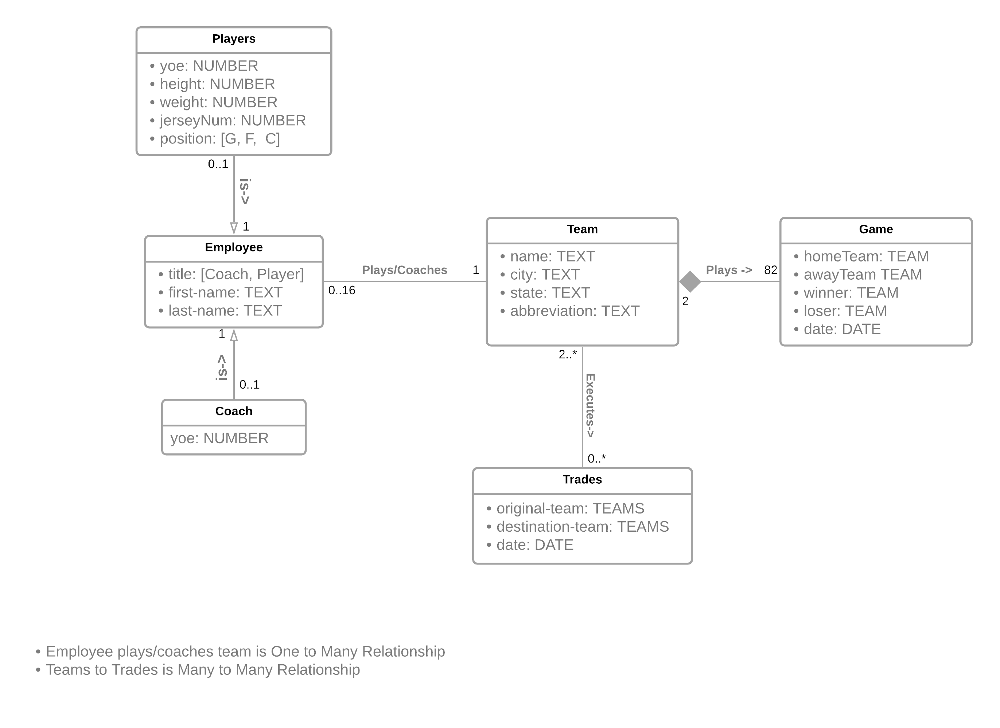
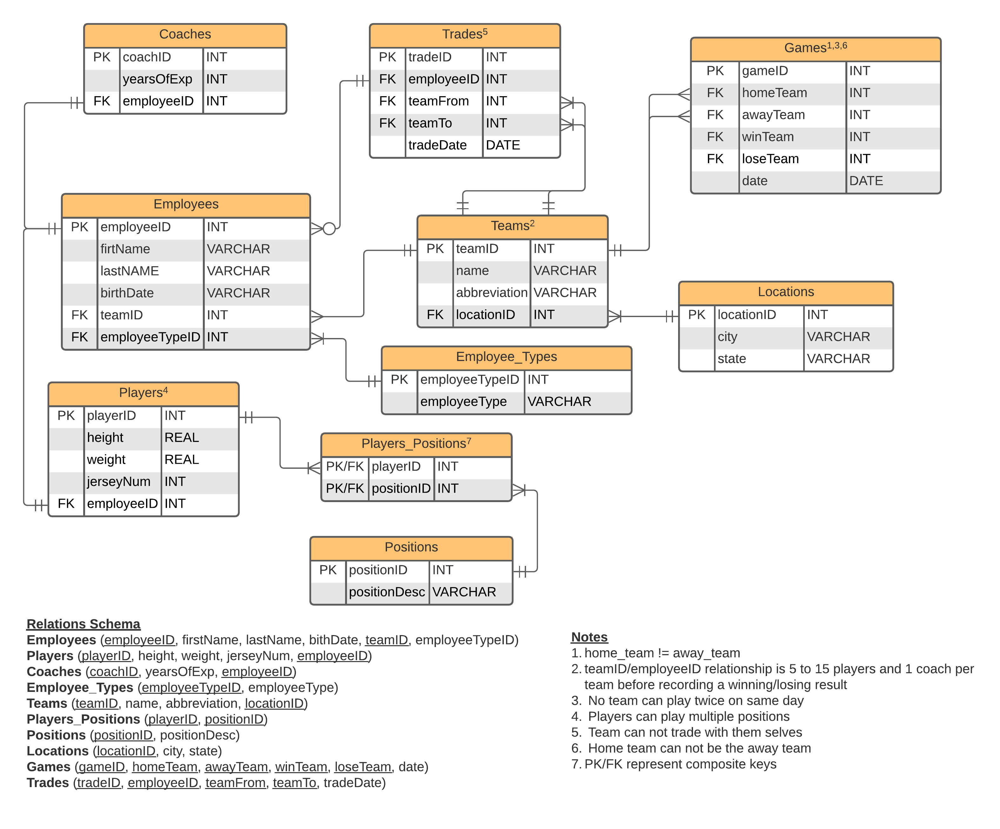

# nbaDatabase - Authors [Daniel Lisko](https://github.com/djlisko01) and [Michael Chang](https://github.com/michaelchang106)

NBA database for DBMS Project 1 - CS 5200

## Business Requirements and Logical/Conceptual Models

[Business Requirements PDF](./models_and_bus_reqs/Business_Requirements_and_Models_and_BCNF.pdf)

[Business Requirements in Google Docs](https://docs.google.com/document/d/13wTtEmC-XXSWzubHSJDg0rDB8sXb62t-KJJM-X4vpMg/edit?usp=sharing)

### Conceptual Model

[Conceptual Model Lucid Chart](https://lucid.app/lucidchart/728904b6-3eac-41ee-9c80-cc89d811dc4c/edit?viewport_loc=-449%2C-71%2C3131%2C1496%2C0_0&invitationId=inv_bc674f57-3cb0-483b-8c06-247711741271)

### Logical Model

[Logical Model Lucid Chart](https://lucid.app/lucidchart/f8b731fe-7480-4e96-b786-84ca747ef028/edit?viewport_loc=-303%2C16%2C2219%2C1012%2C0_0&invitationId=inv_b1efe1a2-5c17-497c-80c0-568e9ae0d801)

## Relational Schema with BCNF Proof

The BCNF proof is in the [Business Requirements Document](./models_and_bus_reqs/Business_Requirements_and_Models_and_BCNF.pdf)
In the SCHEMA is BCNF section

[Business Requirements Document Google Docs](https://docs.google.com/document/d/13wTtEmC-XXSWzubHSJDg0rDB8sXb62t-KJJM-X4vpMg/edit?usp=sharing)
In the SCHEMA is BCNF section

## SQL File w/ Table Definitions/Creation (DDL)

[SQL File with Table Definitions/Creation](./database/nba-database.sql)
SQL creation scripts to be ran in SQLite3

## Data used to populate the Tables (DML through DB Browser Import CSV)

## SQL queries used to query information from our database with test data (DML)

[Various SQL query demonstrations](./database/sql_queries.sql):

- showing join of at least three tables
- subqueries
- group by with a having clause
- complex search criterion

## Screenshots showing functionality of constraints

[Screenshots pasted into xlsx file](./database/Constraint_Screen_Shots.xlsx)

[Screenshots pasted into Google Sheets](https://docs.google.com/spreadsheets/d/1euBu5pVi-Z4aii9Y-7CNDByd4slmUOYCvw8Q6XpOylI/edit?usp=sharing)

## Division of works and tasks

### Both team members collaborated and contributed evenly on the design and implementation of the database with SQLite, LucidChart, and Google Suite

### [Michael Chang](https://github.com/michaelchang106) created the CRUD Operations and interface for Games table

### [Daniel Lisko](https://github.com/djlisko01) created the CRUD Operations and interface for Players table (and inherently Employees)

## Execution of project

- Download the code to your preferred directory
- Open that directory with your preferred terminal
- type "npm install" and hit enter
- type "npm start" and hit enter
- navigate to "http://localhost:3000/" in your preferred browser
- use our developed interface to perform CRUD operations on the Employees -> Players & Coaches, and Games Tables
